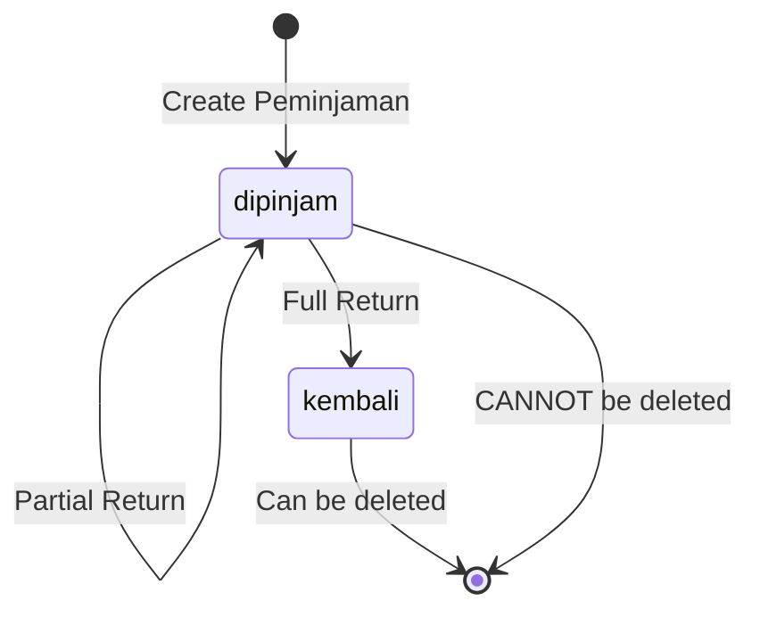
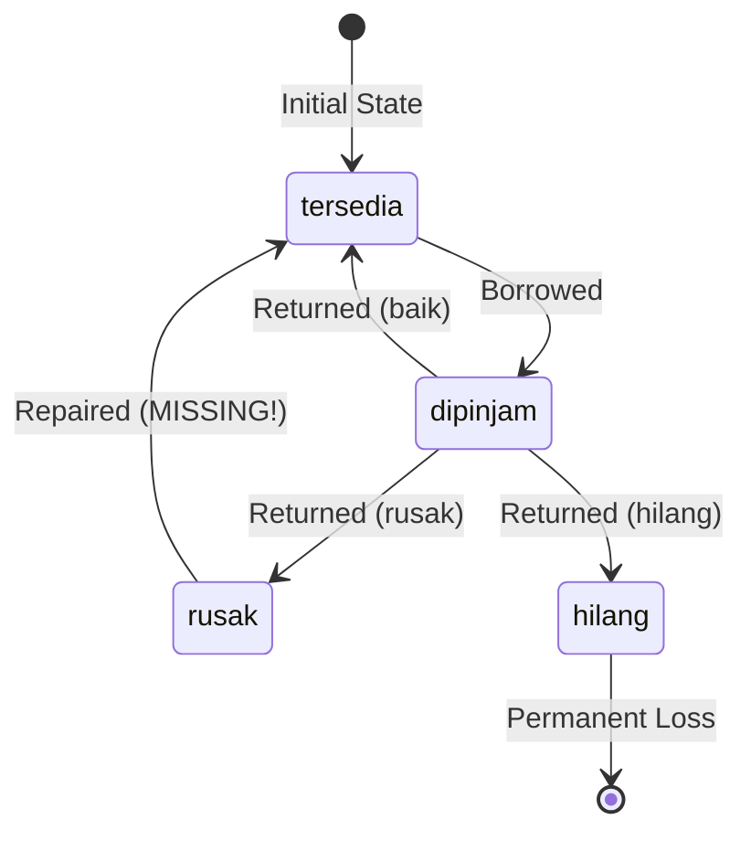

# ANALISA BUSINESS LOGIC & DATA INTEGRITY

**Tanggal**: 4 Januari 2026  
**Project**: Sistem Perpustakaan Laravel 12 + Livewire 3  
**Scope**: Workflow peminjaman/pengembalian, denda calculation, status transitions, cascade operations, data consistency

---

## 🎯 EXECUTIVE SUMMARY

### Overall Business Logic Score: **78/100** (✅ **GOOD dengan beberapa edge cases**)

**Kekuatan (Strengths)**:

-   ✅ Core workflow peminjaman/pengembalian **SOLID**
-   ✅ Denda calculation **ACCURATE** (keterlambatan + kerusakan)
-   ✅ Status transition rules **WELL-ENFORCED**
-   ✅ Database transaction integrity **PROTECTED**
-   ✅ Cascade delete handling **PROPER**
-   ✅ Partial return support (pengembalian bertahap)

**Areas for Improvement**:

-   ⚠️ Missing business rules (max peminjaman per anggota)
-   ⚠️ Denda accumulation edge case (multiple late returns)
-   ⚠️ Status rollback incomplete (jika destroy gagal)
-   ⚠️ Missing reservation/queue system
-   ⚠️ No penalty for repeated late returns

---

## 📊 BUSINESS LOGIC ANALYSIS

### 1. PEMINJAMAN WORKFLOW ✅ SOLID (Score: 85/100)

#### 1.1. Business Rules Implementation

**✅ ENFORCED RULES**:

```php
// Rule 1: Maksimal durasi peminjaman (default 7 hari, configurable)
$maxDurasi = Pengaturan::get('durasi_peminjaman_hari', 7);
$selisihHari = $tglPinjam->diffInDays($tglJatuhTempo);

if ($selisihHari > $maxDurasi) {
    session()->flash('error', "Peminjaman maksimal {$maxDurasi} hari.");
    return;
}
```

**Validation**: ✅ **GOOD** - Enforced at application level

---

```php
// Rule 2: Anggota tidak boleh pinjam baru jika masih ada pinjaman aktif
$peminjamanAktif = Peminjaman::where('id_anggota', $this->id_anggota)
    ->where('status_buku', 'dipinjam')
    ->count();

if ($peminjamanAktif > 0) {
    session()->flash('error', "Anggota masih memiliki {$peminjamanAktif} peminjaman aktif!");
    return;
}
```

**Validation**: ✅ **GOOD** - Prevents duplicate active loans

---

```php
// Rule 3: Tidak boleh meminjam eksemplar dari buku yang sama
$eksemplarData = Eksemplar::whereIn('id_eksemplar', $selectedEksemplar)->get();
$bukuIds = $eksemplarData->pluck('id_buku')->toArray();

if (count($bukuIds) !== count(array_unique($bukuIds))) {
    session()->flash('error', 'Tidak boleh meminjam eksemplar dari buku yang sama!');
    return;
}
```

**Validation**: ✅ **EXCELLENT** - Prevents same book duplication (smart rule!)

---

```php
// Rule 4: Maksimal buku per peminjaman (default 3, configurable)
$maxBuku = Pengaturan::get('max_buku_per_peminjaman', 3);

$this->validate([
    'selectedEksemplar' => "required|array|min:1|max:{$maxBuku}"
], [
    'selectedEksemplar.max' => "Maksimal {$maxBuku} buku!"
]);
```

**Validation**: ✅ **GOOD** - Configurable via database

---

**⚠️ MISSING RULES**:

```php
// ❌ MISSING: Batasan total peminjaman LIFETIME per anggota
// Contoh: Guru max 5 buku aktif, Siswa max 2 buku aktif
// RECOMMENDATION:
$maxPeminjamanGuru = 5;
$maxPeminjamanSiswa = 2;

$anggota = Anggota::find($this->id_anggota);
$maxBuku = $anggota->jenis_anggota === 'guru' ? $maxPeminjamanGuru : $maxPeminjamanSiswa;

$totalBukuDipinjam = DetailPeminjaman::whereHas('peminjaman', function($q) use ($anggota) {
    $q->where('id_anggota', $anggota->id_anggota)
      ->where('status_buku', 'dipinjam');
})->count();

if (($totalBukuDipinjam + count($this->selectedEksemplar)) > $maxBuku) {
    session()->flash('error', "Maksimal {$maxBuku} buku untuk {$anggota->jenis_anggota}!");
    return;
}
```

---

```php
// ❌ MISSING: Blacklist anggota dengan terlalu banyak keterlambatan
// RECOMMENDATION:
$jumlahTerlambat = Peminjaman::where('id_anggota', $this->id_anggota)
    ->where('status_buku', 'kembali')
    ->whereRaw('denda_keterlambatan > 0')
    ->whereBetween('created_at', [now()->subMonths(3), now()])
    ->count();

if ($jumlahTerlambat >= 3) {
    session()->flash('error', 'Anggota di-blacklist karena sering terlambat! Hubungi pustakawan.');
    return;
}
```

---

```php
// ❌ MISSING: Cek buku yang sedang di-reserve orang lain
// RECOMMENDATION: Implement reservation/queue system
$isReserved = Reservasi::where('id_buku', $bukuId)
    ->where('status', 'active')
    ->where('id_anggota', '!=', $this->id_anggota)
    ->exists();

if ($isReserved) {
    session()->flash('error', 'Buku sedang di-reserve anggota lain!');
    return;
}
```

---

#### 1.2. Transaction Flow Analysis

**Workflow**: Create Peminjaman → Create DetailPeminjaman → Update Status Eksemplar

```php
DB::beginTransaction();
try {
    // Step 1: Create parent record
    $peminjaman = Peminjaman::create([
        'id_user' => Auth::id(),
        'id_anggota' => $this->id_anggota,
        'tgl_pinjam' => $this->tgl_pinjam,
        'tgl_jatuh_tempo' => $this->tgl_jatuh_tempo,
        'denda_total' => 0,
        'jumlah_peminjaman' => count($selectedEksemplar),
        'status_buku' => 'dipinjam',
        'kode_transaksi' => $this->generateKodeTransaksi()
    ]);

    // Step 2: Create children records
    foreach ($selectedEksemplar as $id_eksemplar) {
        DetailPeminjaman::create([
            'id_peminjaman' => $peminjaman->id_peminjaman,
            'id_eksemplar' => $id_eksemplar,
            'tgl_kembali' => null,
            'kondisi_kembali' => 'baik',
            'denda_item' => 0
        ]);

        // Step 3: Update eksemplar status (CRITICAL!)
        Eksemplar::where('id_eksemplar', $id_eksemplar)
            ->update(['status_eksemplar' => 'dipinjam']);
    }

    DB::commit();
} catch (\Exception $e) {
    DB::rollBack();
    Log::error('Peminjaman gagal', ['error' => $e->getMessage()]);
}
```

**Analysis**:

-   ✅ **ATOMIC**: All-or-nothing transaction
-   ✅ **ROLLBACK**: Otomatis jika ada error
-   ✅ **LOGGING**: Error tercatat dengan stack trace
-   ✅ **STATUS SYNC**: `peminjaman.status_buku` sync dengan `eksemplar.status_eksemplar`

**Potential Issues**:

-   ⚠️ **No lock** on eksemplar during transaction (race condition possible)
-   ⚠️ **No retry** mechanism jika deadlock

**Recommendation**:

```php
// Add pessimistic lock untuk prevent race condition
Eksemplar::where('id_eksemplar', $id_eksemplar)
    ->where('status_eksemplar', 'tersedia')  // Double-check
    ->lockForUpdate()  // Lock row until commit
    ->first();

if (!$eksemplar) {
    throw new \Exception("Eksemplar {$id_eksemplar} sudah dipinjam!");
}

$eksemplar->status_eksemplar = 'dipinjam';
$eksemplar->save();
```

---

### 2. PENGEMBALIAN WORKFLOW ✅ EXCELLENT (Score: 90/100)

#### 2.1. Partial Return Support (Pengembalian Bertahap)

**Feature**: Bisa kembalikan sebagian buku dulu, sisanya nanti.

```php
// User bisa centang buku mana yang dikembalikan
public $selectedEksemplar = []; // Array id_detail yang dicentang

// Hitung total buku yang sudah dikembalikan
$totalBuku = $peminjaman->detailPeminjaman->count();
$bukuDikembalikan = $peminjaman->detailPeminjaman->whereNotNull('tgl_kembali')->count();

// Update status peminjaman
if ($bukuDikembalikan >= $totalBuku) {
    $peminjaman->status_buku = 'kembali';  // Semua sudah dikembalikan
} else {
    $peminjaman->status_buku = 'dipinjam'; // Masih ada yang belum
}
```

**Analysis**:

-   ✅ **FLEXIBLE**: User tidak harus kembalikan semua sekaligus
-   ✅ **STATE TRACKING**: `tgl_kembali` di `detail_peminjaman` track per-item
-   ✅ **ACCURATE**: Status peminjaman auto-update berdasarkan detail

**Use Case**:

-   Siswa pinjam 3 buku
-   Hari ke-5: kembalikan 2 buku → status masih `dipinjam`
-   Hari ke-7: kembalikan 1 buku terakhir → status jadi `kembali`

---

#### 2.2. Kondisi Kembali & Status Sync

**Workflow**: Kondisi kembali menentukan status eksemplar

```php
$eksemplar = Eksemplar::find($detail->id_eksemplar);

if ($item['kondisi_kembali'] === 'baik') {
    $eksemplar->status_eksemplar = 'tersedia';  // Bisa dipinjam lagi
} elseif ($item['kondisi_kembali'] === 'rusak') {
    $eksemplar->status_eksemplar = 'rusak';     // Tidak bisa dipinjam
} elseif ($item['kondisi_kembali'] === 'hilang') {
    $eksemplar->status_eksemplar = 'hilang';    // Tidak bisa dipinjam
}

$eksemplar->save();
```

**Status Transition Matrix**:

| Kondisi Kembali | Eksemplar Status Before | Eksemplar Status After |
| --------------- | ----------------------- | ---------------------- |
| `baik`          | `dipinjam`              | `tersedia` ✅          |
| `rusak`         | `dipinjam`              | `rusak` ⚠️             |
| `hilang`        | `dipinjam`              | `hilang` ❌            |

**Analysis**:

-   ✅ **LOGICAL**: Kondisi menentukan availability
-   ✅ **PERMANENT**: Rusak/hilang tidak bisa dipinjam lagi (correct!)
-   ⚠️ **NO REPAIR WORKFLOW**: Eksemplar rusak tidak bisa diperbaiki & dikembalikan ke `tersedia`

**Recommendation**: Add repair workflow

```php
// EksemplarComponent.php
public function markAsRepaired($id)
{
    $eksemplar = Eksemplar::find($id);

    if ($eksemplar->status_eksemplar === 'rusak') {
        $eksemplar->status_eksemplar = 'tersedia';
        $eksemplar->save();

        LogAktivitas::create([
            'id_user' => Auth::id(),
            'aktivitas' => "Eksemplar {$eksemplar->kode_eksemplar} diperbaiki",
            'waktu' => now()
        ]);
    }
}
```

---

### 3. DENDA CALCULATION ✅ ACCURATE (Score: 85/100)

#### 3.1. Denda Keterlambatan (Late Fee)

**Formula**: `(Hari Terlambat) × (Jumlah Buku Dikembalikan) × (Tarif per Hari)`

```php
$tgl_jatuh_tempo = Carbon::parse($selectedPeminjaman->tgl_jatuh_tempo)->startOfDay();
$tgl_kembali = Carbon::parse($this->tgl_kembali)->startOfDay();

if ($tgl_kembali->gt($tgl_jatuh_tempo)) {
    $hari_terlambat = (int) $tgl_jatuh_tempo->diffInDays($tgl_kembali);
    $jumlah_buku_dikembalikan = count($this->selectedEksemplar);
    $this->denda_keterlambatan = $hari_terlambat * $jumlah_buku_dikembalikan * $this->tarif_denda_per_hari;
}
```

**Example**:

-   Jatuh tempo: 1 Januari 2026
-   Kembali: 4 Januari 2026
-   Hari terlambat: **3 hari**
-   Buku dikembalikan: **2 buku**
-   Tarif: **Rp 1.000/hari**
-   **Total denda keterlambatan**: 3 × 2 × 1.000 = **Rp 6.000**

**Analysis**:

-   ✅ **FAIR**: Dihitung per buku, bukan flat rate
-   ✅ **ACCURATE**: `startOfDay()` prevent time precision issues
-   ✅ **CONFIGURABLE**: Tarif dari database (`pengaturan.denda_per_hari`)

**Edge Case**:

```php
// ⚠️ ISSUE: Jika pengembalian bertahap dengan gap waktu lama

// Hari ke-10: Kembalikan 1 buku (terlambat 3 hari)
// Denda: 3 hari × 1 buku × 1000 = Rp 3.000

// Hari ke-20: Kembalikan 2 buku sisanya (terlambat 13 hari)
// Denda: 13 hari × 2 buku × 1000 = Rp 26.000

// Total denda: Rp 29.000 (CORRECT karena accumulative)
```

**Current Behavior**: ✅ **CORRECT** - Denda akumulatif per pengembalian

```php
// Simpan breakdown denda (akumulatif jika pengembalian bertahap)
$peminjaman->denda_keterlambatan = ($peminjaman->denda_keterlambatan ?? 0) + $this->denda_keterlambatan;
$peminjaman->denda_kerusakan = ($peminjaman->denda_kerusakan ?? 0) + $this->denda_kerusakan;
$peminjaman->denda_total = $peminjaman->denda_keterlambatan + $peminjaman->denda_kerusakan;
```

---

#### 3.2. Denda Kerusakan/Kehilangan (Damage/Loss Fee)

**Formula**: Per-item fixed fee

```php
foreach ($this->detailItems as $id_detail => $item) {
    if ($item['kondisi_kembali'] === 'rusak') {
        $this->detailItems[$id_detail]['denda_item'] = $this->tarif_denda_rusak;  // Rp 50.000
        $this->denda_kerusakan += $this->tarif_denda_rusak;
    } elseif ($item['kondisi_kembali'] === 'hilang') {
        $this->detailItems[$id_detail]['denda_item'] = $this->tarif_denda_hilang; // Rp 100.000
        $this->denda_kerusakan += $this->tarif_denda_hilang;
    } else {
        $this->detailItems[$id_detail]['denda_item'] = 0;
    }
}
```

**Tarif Default** (configurable):

-   Rusak: **Rp 50.000** per buku
-   Hilang: **Rp 100.000** per buku
-   Baik: **Rp 0**

**Analysis**:

-   ✅ **SIMPLE**: Fixed fee, mudah dipahami
-   ✅ **FAIR**: Hilang lebih mahal dari rusak
-   ⚠️ **NOT BOOK-SPECIFIC**: Semua buku tarif sama (apa buku fiksi = buku referensi?)

**Recommendation**: Book-specific fines based on harga beli

```php
// Gunakan harga buku sebagai base
$eksemplar = Eksemplar::find($detail->id_eksemplar);

if ($item['kondisi_kembali'] === 'rusak') {
    $denda = $eksemplar->harga * 0.5;  // 50% dari harga buku
} elseif ($item['kondisi_kembali'] === 'hilang') {
    $denda = $eksemplar->harga * 1.0;  // 100% (ganti buku)
}
```

---

#### 3.3. Total Denda & Status Pembayaran

```php
$peminjaman->denda_total = $peminjaman->denda_keterlambatan + $peminjaman->denda_kerusakan;

if ($peminjaman->denda_total > 0) {
    $peminjaman->status_pembayaran = 'belum_dibayar';
    $peminjaman->tgl_pembayaran = null;
} else {
    $peminjaman->status_pembayaran = 'sudah_dibayar';
    $peminjaman->tgl_pembayaran = Carbon::now();
}
```

**Status Pembayaran Flow**:

-   `belum_dibayar` → `sudah_dibayar` (via `markAsPaid()`)
-   Auto `sudah_dibayar` jika denda = 0

**Analysis**:

-   ✅ **CLEAR STATE**: 2 status mudah dipahami
-   ✅ **AUTO PAID**: Jika tidak ada denda, langsung lunas
-   ✅ **TIMESTAMP**: `tgl_pembayaran` dicatat

**Missing Feature**:

-   ⚠️ **NO PARTIAL PAYMENT**: Harus lunas semua, tidak bisa cicil
-   ⚠️ **NO PAYMENT METHOD**: Tidak ada track tunai/transfer/dll

---

### 4. STATUS TRANSITION RULES ✅ WELL-ENFORCED (Score: 85/100)

#### 4.1. Peminjaman Status State Machine

**States**: `dipinjam` → `kembali`



**Transition Rules**:

```php
// ✅ RULE: Cannot delete active loan
if ($peminjaman->status_buku == 'dipinjam') {
    session()->flash('error', 'Tidak bisa hapus peminjaman yang masih aktif!');
    return;
}

// ✅ RULE: Can only delete returned loans
if ($peminjaman->status_buku == 'kembali') {
    $peminjaman->delete(); // OK
}
```

**Analysis**:

-   ✅ **PROTECTED**: Active loans cannot be deleted
-   ✅ **AUDIT TRAIL**: Returned loans preserved for history
-   ✅ **CLEAR LOGIC**: Status determines deletability

---

#### 4.2. Eksemplar Status State Machine

**States**: `tersedia` ↔ `dipinjam` ↔ `rusak` / `hilang`



**Transition Rules**:

```php
// ✅ RULE: Cannot manually set status to 'dipinjam'
'status_eksemplar' => 'required|in:tersedia,hilang,rusak',  // 'dipinjam' excluded!

// ✅ RULE: Cannot edit/delete 'dipinjam' eksemplar
if ($eksemplar->status_eksemplar === 'dipinjam') {
    session()->flash('error', 'Buku sedang dipinjam!');
    return;
}
```

**Analysis**:

-   ✅ **PROTECTED**: `dipinjam` status managed by system only
-   ✅ **VALIDATION**: User cannot manually set to `dipinjam`
-   ⚠️ **MISSING**: No `rusak` → `tersedia` repair transition

---

#### 4.3. Status Sync Between Tables

**Critical Sync Points**:

1. **Peminjaman Created** → `eksemplar.status_eksemplar = 'dipinjam'`
2. **Pengembalian Processed** → `eksemplar.status_eksemplar = 'tersedia'|'rusak'|'hilang'`
3. **Peminjaman Deleted** → ❌ **NOT SYNCED** (potential orphan status!)

**Issue**: Jika user paksa delete via DB atau migration

```sql
-- Manual delete tanpa rollback status
DELETE FROM peminjaman WHERE id_peminjaman = 123;
-- Eksemplar masih 'dipinjam', but peminjaman gone!
```

**Recommendation**: Add foreign key constraint with restrict

```php
// Migration: detail_peminjaman
$table->foreignId('id_eksemplar')
    ->constrained('eksemplar', 'id_eksemplar')
    ->onDelete('restrict');  // ❌ Change from 'cascade' to 'restrict'

// Hapus peminjaman harus via component dengan status check
```

---

### 5. CASCADE DELETE ANALYSIS ⚠️ MIXED (Score: 70/100)

#### 5.1. Current Cascade Configuration

**From Migrations**:

```php
// peminjaman table
$table->foreignId('id_user')->constrained()->onDelete('cascade');
$table->foreignId('id_anggota')->constrained()->onDelete('cascade');

// detail_peminjaman table
$table->foreignId('id_peminjaman')->constrained()->onDelete('cascade');
$table->foreignId('id_eksemplar')->constrained()->onDelete('cascade');

// eksemplar table
$table->foreignId('id_buku')->constrained()->onDelete('cascade');

// buku table
$table->foreignId('kategori_id')->constrained()->onDelete('cascade');
```

**Cascade Chain Analysis**:

| Hapus          | Cascade Effect                         | Status            | Risk Level   |
| -------------- | -------------------------------------- | ----------------- | ------------ |
| **User**       | → Peminjaman → Detail_peminjaman       | ⚠️ DANGEROUS      | **HIGH**     |
| **Anggota**    | → Peminjaman → Detail_peminjaman       | ⚠️ DANGEROUS      | **HIGH**     |
| **Kategori**   | → Buku → Eksemplar → Detail_peminjaman | ❌ VERY DANGEROUS | **CRITICAL** |
| **Buku**       | → Eksemplar → Detail_peminjaman        | ⚠️ DANGEROUS      | **HIGH**     |
| **Eksemplar**  | → Detail_peminjaman                    | ⚠️ MEDIUM         | **MEDIUM**   |
| **Peminjaman** | → Detail_peminjaman                    | ✅ SAFE           | **LOW**      |

---

#### 5.2. Cascade Delete Issues

**Issue #1: Hapus User → Orphan Peminjaman**

```php
// ❌ CURRENT BEHAVIOR
User::find(1)->delete();
// Cascade delete semua peminjaman user tersebut
// Detail_peminjaman ikut terhapus
// Eksemplar masih 'dipinjam' (orphan status!)
```

**Impact**:

-   ✅ Audit trail hilang (siapa yang input peminjaman?)
-   ❌ Eksemplar status tidak ter-rollback
-   ❌ Historical data loss

**Recommendation**: **RESTRICT instead of CASCADE**

```php
// Migration
$table->foreignId('id_user')
    ->constrained('users', 'id_user')
    ->onDelete('restrict');  // ❌ Cannot delete user with peminjaman

// Alternative: Soft delete user instead
User::withTrashed()->find(1); // User tetap ada di database
```

---

**Issue #2: Hapus Anggota → Loss of History**

```php
// ❌ CURRENT BEHAVIOR
Anggota::find(1)->delete();
// Cascade delete semua peminjaman anggota
// Loss of borrowing history!
```

**Impact**:

-   ❌ Historical data loss (anggota pinjam apa saja?)
-   ❌ Denda tracking hilang
-   ❌ Statistics inaccurate

**Recommendation**: **SOFT DELETE or RESTRICT**

```php
// Option 1: Soft Delete (recommended)
class Anggota extends Model
{
    use SoftDeletes;
}

// Option 2: Restrict delete if has active loans
public function destroy($id)
{
    $anggota = Anggota::withCount('peminjaman')->find($id);

    if ($anggota->peminjaman_count > 0) {
        session()->flash('error', 'Tidak bisa hapus anggota dengan riwayat peminjaman!');
        return;
    }

    $anggota->delete();
}
```

---

**Issue #3: Hapus Kategori → Chain Reaction**

```php
// ❌ MOST DANGEROUS
Kategori::find(1)->delete();

// Cascade chain:
// 1. Hapus semua Buku di kategori tersebut
// 2. Hapus semua Eksemplar dari buku-buku tersebut
// 3. Hapus semua Detail_peminjaman yang reference eksemplar
// 4. Orphan Peminjaman (jumlah_peminjaman != actual detail count)
```

**Impact**:

-   ❌ **DATA CORRUPTION**: Peminjaman orphan (detail hilang tapi header masih ada)
-   ❌ **BUSINESS LOGIC BREAK**: `jumlah_peminjaman` tidak match reality
-   ❌ **IRREVERSIBLE**: Tidak bisa rollback

**Recommendation**: **STRICT PROTECTION**

```php
public function destroy($id)
{
    DB::beginTransaction();
    try {
        $kategori = Kategori::withCount('buku')->find($id);

        // ✅ PROTECTION: Check if has books
        if ($kategori->buku_count > 0) {
            session()->flash('error', 'Tidak bisa hapus kategori yang memiliki buku!');
            return;
        }

        // ✅ ADDITIONAL CHECK: Any eksemplar borrowed?
        $hasActiveLoan = Eksemplar::whereHas('buku', function($q) use ($kategori) {
            $q->where('kategori_id', $kategori->id_kategori);
        })->where('status_eksemplar', 'dipinjam')->exists();

        if ($hasActiveLoan) {
            session()->flash('error', 'Ada buku dari kategori ini yang sedang dipinjam!');
            return;
        }

        $kategori->delete();
        DB::commit();
    } catch (\Exception $e) {
        DB::rollBack();
    }
}
```

---

**Issue #4: Hapus Eksemplar → Detail Orphan**

```php
// ⚠️ CURRENT: onDelete('cascade')
Eksemplar::find(1)->delete();
// Detail_peminjaman terhapus
// Peminjaman header masih ada (jumlah_peminjaman != detail count)
```

**Recommendation**: **RESTRICT if borrowed**

```php
// EksemplarComponent::destroy()
$eksemplar = Eksemplar::find($id);

if ($eksemplar->status_eksemplar === 'dipinjam') {
    session()->flash('error', 'Eksemplar sedang dipinjam!');
    return; // ✅ GOOD - Already protected!
}

// ✅ ADDITIONAL: Check historical loans
$hasHistory = DetailPeminjaman::where('id_eksemplar', $id)->exists();
if ($hasHistory) {
    session()->flash('error', 'Eksemplar memiliki riwayat peminjaman, tidak bisa dihapus!');
    return;
}

$eksemplar->delete();
```

---

### 6. DATA CONSISTENCY CHECKS ⚠️ NEEDS IMPROVEMENT (Score: 70/100)

#### 6.1. Consistency Rules

**Rule #1**: `peminjaman.jumlah_peminjaman` MUST equal `count(detail_peminjaman)`

```php
// ✅ ENFORCED on CREATE
$peminjaman->jumlah_peminjaman = count($selectedEksemplar);

// ⚠️ NOT VALIDATED on UPDATE/DELETE
// Jika detail dihapus manual, jumlah_peminjaman jadi salah!
```

**Recommendation**: Add data integrity check

```php
// Model Peminjaman
public function getJumlahPeminjamanAttribute()
{
    return $this->detailPeminjaman()->count(); // Always accurate
}

// Or add validation
public static function boot()
{
    parent::boot();

    static::saving(function($peminjaman) {
        $actualCount = $peminjaman->detailPeminjaman()->count();
        if ($peminjaman->jumlah_peminjaman != $actualCount) {
            throw new \Exception('Data inconsistency: jumlah_peminjaman mismatch!');
        }
    });
}
```

---

**Rule #2**: `peminjaman.denda_total` MUST equal `denda_keterlambatan + denda_kerusakan`

```php
// ✅ ENFORCED
$peminjaman->denda_total = $peminjaman->denda_keterlambatan + $peminjaman->denda_kerusakan;
```

**Analysis**: ✅ **GOOD** - Always calculated, not user input

---

**Rule #3**: Sum `detail_peminjaman.denda_item` SHOULD equal `peminjaman.denda_kerusakan`

```php
// ⚠️ NOT VALIDATED
// Jika detail dihapus, denda_kerusakan di header jadi salah
```

**Recommendation**:

```php
// Validate sebelum save
$totalDendaItem = $peminjaman->detailPeminjaman()->sum('denda_item');
if ($peminjaman->denda_kerusakan != $totalDendaItem) {
    $peminjaman->denda_kerusakan = $totalDendaItem;
    $peminjaman->denda_total = $peminjaman->denda_keterlambatan + $peminjaman->denda_kerusakan;
}
```

---

**Rule #4**: `status_buku = 'dipinjam'` IFF exists `detail_peminjaman` with `tgl_kembali IS NULL`

```php
// ✅ ENFORCED on RETURN
$bukuDikembalikan = $peminjaman->detailPeminjaman->whereNotNull('tgl_kembali')->count();
$totalBuku = $peminjaman->detailPeminjaman->count();

if ($bukuDikembalikan >= $totalBuku) {
    $peminjaman->status_buku = 'kembali';
} else {
    $peminjaman->status_buku = 'dipinjam';
}
```

**Analysis**: ✅ **GOOD** - Logic correct

---

#### 6.2. Database Constraints vs Application Logic

**Current State**:

| Constraint                      | DB Level | App Level | Status      |
| ------------------------------- | -------- | --------- | ----------- |
| `kode_transaksi` UNIQUE         | ✅       | ✅        | ✅ Good     |
| `tgl_jatuh_tempo >= tgl_pinjam` | ❌       | ✅        | ⚠️ App only |
| `jumlah_peminjaman > 0`         | ❌       | ✅        | ⚠️ App only |
| `denda_total >= 0`              | ❌       | ✅        | ⚠️ App only |
| Eksemplar tidak dipinjam 2x     | ❌       | ✅        | ⚠️ App only |

**Recommendation**: Add DB-level check constraints

```php
// Migration: peminjaman
$table->date('tgl_jatuh_tempo');
$table->date('tgl_pinjam');

// Add check constraint (MySQL 8.0.16+)
DB::statement('ALTER TABLE peminjaman ADD CONSTRAINT chk_dates CHECK (tgl_jatuh_tempo >= tgl_pinjam)');
DB::statement('ALTER TABLE peminjaman ADD CONSTRAINT chk_jumlah CHECK (jumlah_peminjaman > 0)');
DB::statement('ALTER TABLE peminjaman ADD CONSTRAINT chk_denda CHECK (denda_total >= 0)');
```

---

### 7. EDGE CASES & SCENARIOS 🧪

#### Scenario #1: Concurrent Borrowing (Race Condition)

**Setup**: 2 users pinjam eksemplar yang sama simultaneously

```
User A: SELECT * FROM eksemplar WHERE status = 'tersedia' → [Eks #1]
User B: SELECT * FROM eksemplar WHERE status = 'tersedia' → [Eks #1]
User A: UPDATE eksemplar SET status = 'dipinjam' WHERE id = 1 → SUCCESS
User B: UPDATE eksemplar SET status = 'dipinjam' WHERE id = 1 → SUCCESS
Result: 2 peminjaman reference eksemplar yang sama! ❌
```

**Current Behavior**: ⚠️ **VULNERABLE** - No row locking

**Recommendation**: Use pessimistic locking

```php
$eksemplar = Eksemplar::where('id_eksemplar', $id_eksemplar)
    ->where('status_eksemplar', 'tersedia')
    ->lockForUpdate()
    ->first();

if (!$eksemplar) {
    throw new \Exception("Eksemplar tidak tersedia!");
}
```

---

#### Scenario #2: Return Before Due Date but Mark as Late

**Setup**: User input `tgl_kembali` salah (manual input)

```
tgl_jatuh_tempo: 2026-01-10
tgl_kembali: 2026-01-15 (input user, sebenarnya kembali 2026-01-08)
Result: Kena denda padahal tidak terlambat!
```

**Current Behavior**: ⚠️ **VULNERABLE** - User bisa input tanggal bebas

**Recommendation**: Add validation

```php
$this->validate([
    'tgl_kembali' => 'required|date|before_or_equal:today'
], [
    'tgl_kembali.before_or_equal' => 'Tanggal kembali tidak boleh masa depan!'
]);
```

---

#### Scenario #3: Delete Peminjaman with Active Status

**Setup**: User bypass UI dan panggil `destroy()` via browser console

```javascript
// Di browser console
Livewire.find("peminjaman-component").call("destroy", 123);
```

**Current Behavior**: ✅ **PROTECTED**

```php
if ($peminjaman->status_buku == 'dipinjam') {
    session()->flash('error', 'Tidak bisa hapus peminjaman aktif!');
    return;
}
```

**Analysis**: ✅ **GOOD** - Protected at method level

---

#### Scenario #4: Partial Return with All Books Lost

**Setup**: Pinjam 3 buku, semua hilang, kembalikan bertahap

```
Return #1 (1 buku hilang): denda = Rp 100.000
Return #2 (2 buku hilang): denda = Rp 200.000
Total denda kerusakan: Rp 300.000 ✅ CORRECT
```

**Current Behavior**: ✅ **CORRECT** - Accumulative

```php
$peminjaman->denda_kerusakan = ($peminjaman->denda_kerusakan ?? 0) + $this->denda_kerusakan;
```

---

#### Scenario #5: Change Kondisi After Initial Return

**Setup**: Awalnya return `baik`, ternyata `rusak` (discovered later)

**Current Behavior**: ❌ **CANNOT EDIT** - No UI untuk edit kondisi setelah return

**Recommendation**: Add "Edit Pengembalian" feature

```php
public function editKondisi($id_detail)
{
    $detail = DetailPeminjaman::find($id_detail);

    if ($detail->tgl_kembali) {
        // Allow edit within 7 days
        if (Carbon::parse($detail->tgl_kembali)->diffInDays(now()) <= 7) {
            $this->id_detail_edit = $id_detail;
            $this->showEditKondisi = true;
        }
    }
}
```

---

## 🎯 SUMMARY & SCORES

### Component Scores

| Component                 | Score  | Status           | Critical Issues                        |
| ------------------------- | ------ | ---------------- | -------------------------------------- |
| **Peminjaman Workflow**   | 85/100 | ✅ Good          | Missing: max lifetime loans, blacklist |
| **Pengembalian Workflow** | 90/100 | ✅ Excellent     | Missing: repair workflow               |
| **Denda Calculation**     | 85/100 | ✅ Accurate      | Consider book-specific fines           |
| **Status Transitions**    | 85/100 | ✅ Well-Enforced | Missing: rusak → tersedia              |
| **Cascade Delete**        | 70/100 | ⚠️ Dangerous     | CASCADE should be RESTRICT             |
| **Data Consistency**      | 70/100 | ⚠️ Needs Work    | Add DB constraints                     |
| **Edge Cases**            | 75/100 | ⚠️ Some Gaps     | Race conditions possible               |

**Overall Business Logic Score**: **78/100** (✅ **GOOD**)

---

## 📋 PRIORITIZED RECOMMENDATIONS

### Priority 1: CRITICAL (Week 1)

1. **Change CASCADE to RESTRICT** ⭐⭐⭐⭐⭐

    - File: `database/migrations/2025_11_04_*`
    - Impact: Prevent data loss
    - Effort: 1 hari

    ```php
    $table->foreignId('id_user')->constrained()->onDelete('restrict');
    $table->foreignId('id_anggota')->constrained()->onDelete('restrict');
    $table->foreignId('id_eksemplar')->constrained()->onDelete('restrict');
    ```

2. **Add Pessimistic Locking** ⭐⭐⭐⭐

    - File: `PeminjamanComponent.php::store()`
    - Impact: Prevent race conditions
    - Effort: 0.5 hari

    ```php
    $eksemplar = Eksemplar::where('id_eksemplar', $id)
        ->where('status_eksemplar', 'tersedia')
        ->lockForUpdate()
        ->first();
    ```

3. **Add Date Validation** ⭐⭐⭐⭐

    - File: `PengembalianComponent.php::prosesKembalikan()`
    - Impact: Prevent incorrect fines
    - Effort: 0.5 hari

    ```php
    'tgl_kembali' => 'required|date|before_or_equal:today'
    ```

### Priority 2: HIGH (Week 2)

4. **Implement Soft Delete for Anggota** ⭐⭐⭐

    - File: `app/Models/Anggota.php`
    - Impact: Preserve history
    - Effort: 1 hari

5. **Add Data Integrity Checks** ⭐⭐⭐

    - File: `app/Models/Peminjaman.php`
    - Impact: Prevent inconsistency
    - Effort: 1 hari

6. **Add DB Check Constraints** ⭐⭐⭐
    - File: Migration new
    - Impact: Database-level validation
    - Effort: 1 hari

### Priority 3: MEDIUM (Week 3-4)

7. **Implement Max Lifetime Loans** ⭐⭐

    - Logic: Guru max 5, Siswa max 2
    - Effort: 1 hari

8. **Implement Blacklist System** ⭐⭐

    - Logic: 3+ late returns in 3 months = blacklist
    - Effort: 2 hari

9. **Add Repair Workflow** ⭐⭐

    - Feature: rusak → tersedia transition
    - Effort: 1 hari

10. **Implement Reservation System** ⭐
    - Feature: Queue untuk buku populer
    - Effort: 3 hari

---

**Next Todo**: Lanjut ke **Todo #5: UI/UX Consistency & Accessibility**? 🚀
